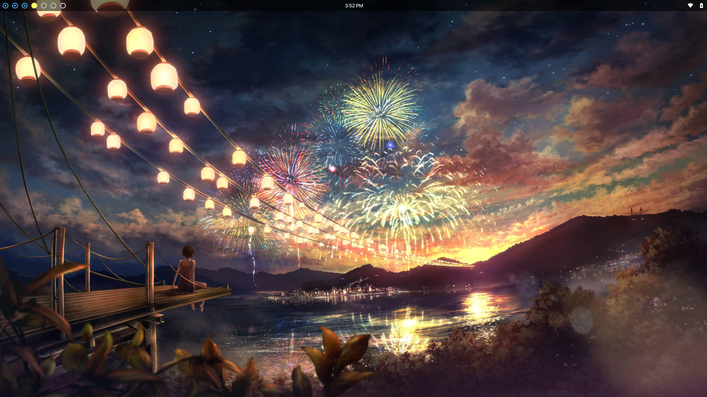

# Kyle's Linux Setup
This is my collection of configuration files.

Some key details of my setup:
- Distro: Arch Linux
- WM: AwesomeWM
- Editor: Neovim
- Terminal: kitty
- Shell: fish
- Music Player: ncmpcpp
- Monitor: gotop

